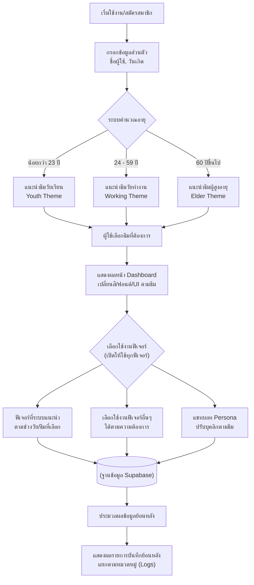
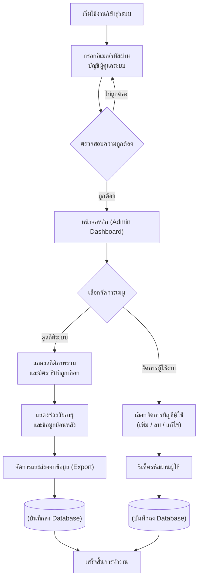

# Proposal: CareFate - ระบบบันทึกและติดตามสุขภาพอัจฉริยะสำหรับทุกช่วงวัย

## บทคัดย่อ
โครงการนี้มีวัตถุประสงค์เพื่อพัฒนาแอปพลิเคชัน **“CareFate”** ซึ่งเป็นระบบบันทึกและติดตามข้อมูลสุขภาพสำหรับผู้ใช้งานทุกช่วงวัย โดยนำเทคโนโลยีปัญญาประดิษฐ์ (AI) มาช่วยในการสรุปผลและให้คำแนะนำเบื้องต้นจากการบันทึกพฤติกรรมในแต่ละวัน ระบบมีการออกแบบธีมที่เหมาะสมกับกลุ่มเป้าหมายแต่ละช่วงวัย พร้อมระบบแสดงข้อมูลย้อนหลังที่เข้าใจง่าย เพื่อส่งเสริมให้ผู้ใช้มีการรู้เท่าทันสุขภาพดิจิทัลและสร้างวินัยในการดูแลสุขภาพอย่างยั่งยืน

**คำสำคัญ**: แอปบันทึกสุขภาพ, การติดตามพฤติกรรมสุขภาพ, AI สำหรับสรุปข้อมูล, UI/UX สำหรับหลากหลายช่วงวัย

## ABSTRACT
This project aims to develop **"CareFate,"** a health logging and tracking application designed for all ages. By integrating Artificial Intelligence (AI) to provide summaries and basic recommendations based on daily user records, the system assists users in managing their health routines. The application features age-specific themes and clear historical data visualization, aiming to enhance digital health literacy and promote sustainable self-care habits through an organized and engaging platform.

**Keywords**: Health logging app, behavior tracking, AI data summarization, multi-generational UI/UX

## บทที่ 1: บทนำ

### 1.1 ที่มาและความสำคัญของปัญหา
ในปัจจุบันผู้คนมีความสนใจและใส่ใจสุขภาพตนเองมากขึ้น จึงมีความต้องการเครื่องมือที่ช่วยติดตามและบันทึกพฤติกรรมกิจกรรมในชีวิตประจำวันอย่างต่อเนื่อง ไม่ว่าจะเป็นการรับประทานยา หรือการนอนหลับ อีกทั้งผู้ใช้งานแต่ละกลุ่มยังมีความจำเป็นที่แตกต่างกันไปตามช่วงวัย เช่น วัยเรียนที่ต้องการการตั้งเป้าหมายชีวิตและการออกกำลังกาย วัยทำงานที่ต้องการการจัดการโภชนาการและดูแลพาหนะส่วนตัว หรือวัยผู้สูงอายุที่ต้องติดตามระบบขับถ่ายและการนัดหมายแพทย์ โครงการนี้จึงพัฒนาแอปมือถือที่เป็นอีกหนึ่งทางเลือกที่จะช่วยตอบสนองต่อความต้องการเหล่านี้ได้อย่างเหมาะสมที่มีการออกแบบธีมของแอปพลิเคชันสำหรับทุกวัย ได้แก่ วัยเรียน วัยทำงาน และวัยผู้สูงอายุ

โดยมีการพัฒนาแอปพลิเคชันที่รวมฟีเจอร์สุขภาพที่จำเป็นไว้ในระบบเดียว ได้แก่ การนอนหลับ การรับประทานยา มื้ออาหาร การดูดวง และการดูข้อมูลย้อนหลัง ซึ่งเป็นการออกแบบให้ผู้ใช้สามารถบันทึกข้อมูลได้ง่ายและนำข้อมูลจากส่วนต่างๆ มาประมวลผลร่วมกันผ่านระบบ AI นอกจากนี้ยังมีระบบ **แชทบอท** ที่มีบุคลิกเปลี่ยนไปตามธีมที่ผู้ใช้เลือก เพื่อสร้างความเป็นกันเอง นอกจากการแจ้งเตือนและบันทึกกิจกรรมสุขภาพในแต่ละวันแล้ว ยังมีการสรุปผลข้อมูลย้อนหลังในรูปแบบที่เข้าใจง่าย ทำให้ผู้ใช้งานสามารถติดตามพฤติกรรมของตนเองได้อย่างมีประสิทธิภาพ

## บทที่ 2: วัตถุประสงค์และฟีเจอร์หลัก

### 2.1 วัตถุประสงค์ (Objectives)
1. เพื่อพัฒนาแอปพลิเคชันที่รวมข้อมูลสุขภาพที่จำเป็นสำหรับทุกช่วงวัยไว้ในระบบเดียวกัน
2. เพื่อออกแบบอินเทอร์เฟซ (UI/UX) ที่เหมาะสมและใช้งานง่ายสำหรับผู้ใช้งานหลากหลายช่วงอายุ (วัยเรียน, วัยทำงาน, วัยผู้สูงอายุ)
3. เพื่อนำเทคโนโลยี AI มาช่วยในการวิเคราะห์และสรุปผลข้อมูลสุขภาพให้ผู้ใช้งานเข้าใจได้ง่าย
4. เพื่อสร้างระบบแจ้งเตือนและติดตามพฤติกรรมสุขภาพที่เป็นระบบและเข้าถึงง่ายสำหรับทุกวัย
5. เพื่อพัฒนาระบบแชทบอทที่มีการปรับเปลี่ยนบุคลิก (Persona) ตามธีมที่ผู้ใช้เลือก เพื่อช่วยให้ข้อมูลและโต้ตอบได้อย่างเป็นกันเอง

### 2.2 รายการฟีเจอร์ทั้งหมดและการแนะนำตามช่วงวัย (All Features & Recommendations)

ผู้ใช้งานทุกช่วงวัยสามารถเข้าถึงและใช้งานได้ทุกฟีเจอร์ในระบบ แต่ระบบจะเน้นการนำเสนอและแนะนำฟีเจอร์ที่เหมาะสมกับช่วงอายุ (ธีม) ที่เลือกเป็นหลัก เพื่อความสะดวกและตรงจุดประสงค์การใช้งาน:

- **ฟีเจอร์ที่แนะนำสำหรับทุกวัย**: การบันทึกยา (Medication), การนอนหลับ (Sleep), มื้ออาหาร (Food), ดวงสุขภาพ (Horoscope), ข้อมูลย้อนหลัง (History)
- **ฟีเจอร์ที่แนะนำเพิ่มเติมตามช่วงวัย**:
    - **วัยเรียน (Youth)**: การตั้งเป้าหมาย (Goals), การออกกำลังกาย (Exercise), บันทึกรอบเดือน (Period)
    - **วัยทำงาน (Working)**: การดูแลรักษาพาหนะ (Vehicle)
    - **วัยผู้สูงอายุ (Elder)**: การบันทึกการขับถ่าย (Excretion), การนัดหมายแพทย์ (Appointment)

## บทที่ 3: แนวคิดการออกแบบระบบ

ระบบนี้ถูกออกแบบมาเพื่อเป็นอีกหนึ่งทางเลือกในการติดตามและบันทึกกิจกรรมด้านสุขภาพในชีวิตประจำวันที่ผู้ใช้งานสามารถวิเคราะห์ความก้าวหน้าของตนเองและเห็นพัฒนาการของตัวเองได้ มีการมุ่งเน้นการออกแบบฟีเจอร์ที่ใช้งานง่าย, สะดวก และตอบโจทย์ทุกช่วงวัยและมีการออกแบบธีมที่เหมาะสมกับทุกวัย ฟีเจอร์ทั้งหมดถูกเชื่อมโยงกันอย่างประมวลผลร่วมกันเพื่อความสะดวกของผู้ใช้งานและช่วยสร้างวินัยในการดูแลสุขภาพอย่างต่อเนื่อง โดยฟีเจอร์ทั้งหมดมีการออกแบบเพื่อช่วยสร้างวินัยและแรงกระตุ้นการติดตามสุขภาพของผู้ใช้งานรวมทั้งสร้างความเพลิดเพลินให้กับผู้ใช้งาน 

หลังจากผู้ใช้สมัครสมาชิกด้วยอีเมลและกำหนดรหัสผ่าน ผู้ใช้งานต้องกรอก ชื่อผู้ใช้ และวันเดือนปีเกิด เมื่อผู้ใช้กรอกข้อมูลระบบจะนำวันเดือนปีเกิดไปคำนวณอายุและแนะนำธีมของผู้ใช้งาน หากผู้ใช้งานไม่ชอบธีมของวัยตนเองสามารถเลือกธีมอื่นได้ จากนั้นระบบจะแสดงผลในรูปแบบธีม (UI) ที่ผู้ใช้งานได้กำหนด ได้แก่:
- **วัยผู้สูงอายุ (60 ปีขึ้นไป)**: ใช้ตัวอักษรขนาดใหญ่และสีที่มองเห็นชัดเจน (Accessibility UI)
- **วัยทำงาน (24-59 ปี)**: เน้นความเรียบง่ายและโทนสีสุภาพ
- **วัยเรียน (12-23 ปี)**: ใช้สีสันสดใสพร้อมการนำเสนอที่กระตุ้นแรงจูงใจ

ระบบจะให้คำแนะนำเบื้องต้นเกี่ยวกับช่วงเวลาตื่น-นอนที่แนะนำ และช่วงเวลารับประทานอาหารที่แนะนำตามกลุ่มอายุ (ธีม) ที่ผู้ใช้งานเลือก หากผู้ใช้กำหนดเวลารับประทานยา ระบบจะช่วยวางตารางเวลาการรับประทานอาหารและเวลาตื่น-นอนให้เหมาะสมโดยอัตโนมัติ เพื่อให้สอดคล้องกับเวลาการรับประทานยาอย่างมีประสิทธิภาพ โดยการใช้งาน (UX) ของทุกวัยจะมีฟีเจอร์หลักร่วมกัน 5 ฟีเจอร์ ได้แก่ การนอนหลับ การรับประทานยา มื้ออาหาร การดูดวง และการดูข้อมูลย้อนหลัง

ภาพที่ 1 Workflow ของผู้ใช้งานเข้าสู่ระบบแอปพลิเคชันมือถือสำหรับบันทึกและแจ้งเตือนกิจกรรมประจำวันพร้อมการติดตามข้อมูลย้อนหลัง โดยเริ่มจากการสมัครสมาชิกและกรอกข้อมูลเพื่อแนะนำธีมที่เหมาะสมตามช่วงอายุ (Youth, Working, Elder)

### 3.1 ขั้นตอนการทำงานหลัก (Main Workflow)
ภาพที่ 1 Workflow ของผู้ใช้งานเข้าสู่ระบบแอปพลิเคชันมือถือสำหรับบันทึกและแจ้งเตือนกิจกรรมประจำวันพร้อมการติดตามข้อมูลย้อนหลัง โดยเริ่มจากการสมัครสมาชิกและกรอกข้อมูลเพื่อแนะนำธีมที่เหมาะสมตามช่วงอายุ (Youth, Working, Elder)

[ภาพประกอบ Workflow]

**ขั้นตอนการทำงานของระบบ (System Operation):**

*   **เริ่มใช้งาน/สมัครสมาชิก**: จุดเริ่มต้นที่ผู้ใช้เข้าสู่แอปพลิเคชันเป็นครั้งแรกเพื่อสร้างบัญชีผู้ใช้
*   **กรอกข้อมูลส่วนตัว (ชื่อผู้ใช้, วันเกิด)**: ระบบขอข้อมูลเพียง 2 อย่างที่จำเป็น คือ "ชื่อผู้ใช้" ที่ต้องการให้เรียก และ "วันเดือนปีเกิด" เพื่อนำไปประมวลผล
*   **ระบบคำนวณอายุ (การตัดสินใจ)**: เป็นหัวใจสำคัญของ Workflow โดยระบบจะนำวันเกิดที่กรอกมาคำนวณอายุปัจจุบันโดยอัตโนมัติ เพื่อแยกผู้ใช้ออกเป็น 3 กลุ่มเป้าหมายหลัก:
    *   **น้อยกว่า 23 ปี**: ระบบจะแนะนำ **ธีมวัยเรียน (Youth Theme)** ที่เน้นความสดใสและฟีเจอร์ที่เหมาะสม
    *   **24 - 59 ปี**: ระบบจะแนะนำ **ธีมวัยทำงาน (Working Theme)** ที่เน้นความเรียบง่ายและประสิทธิภาพ
    *   **60 ปีขึ้นไป**: ระบบจะแนะนำ **ธีมผู้สูงอายุ (Elder Theme)** ที่เน้นตัวอักษรขนาดใหญ่และการเข้าถึงที่ง่าย
*   **ผู้ใช้เลือกธีมที่ต้องการ**: แม้ระบบจะแนะนำธีมที่เหมาะสมกับอายุมาให้ แต่ผู้ใช้ยังคงมีอิสระในการตัดสินใจเลือกธีมที่ตนเองชอบที่สุดก่อนเข้าใช้งานจริง
*   **แสดงผลหน้า Dashboard**: เมื่อเลือกธีมแล้ว ระบบจะปรับเปลี่ยนหน้าหน้าแอปพลิเคชัน (UI) ทั้งโทนสี ฟอนต์ และการจัดวางให้ตรงตามเอกลักษณ์ของธีมนั้นๆ ทันที
*   **เลือกใช้งานฟีเจอร์ (เปิดให้ใช้ทุกฟีเจอร์)**: ระบบเปิดให้ผู้ใช้งานเข้าถึงทุกฟีเจอร์ในระบบอย่างอิสระ ไม่มีการปิดกั้นตามอายุ
*   **การทำงานส่วนฟีเจอร์และแชทบอท**:
    *   **ฟีเจอร์ที่ระบบแนะนำ**: ระบบจะดึงฟีเจอร์ที่เหมาะสมกับธีมที่เลือกขึ้นมาแสดงให้เด่นชัดเพื่อความสะดวกในการใช้งาน
    *   **เลือกใช้งานฟีเจอร์อื่นๆ**: ผู้ใช้ยังคงสามารถเลือกใช้งานฟีเจอร์อื่นๆ เพิ่มเติมได้ตามความต้องการ
    *   **แชทบอท Persona**: ระบบจะปรับเปลี่ยนบุคลิกและการโต้ตอบของ AI Chatbot ให้สอดคล้องกับธีมที่เลือกเพื่อให้เกิดความเป็นกันเอง
*   **ฐานข้อมูล Supabase**: ทุกข้อมูลการบันทึกกิจกรรมจะถูกส่งไปจัดเก็บยังฐานข้อมูลกลางอย่างปลอดภัย
*   **ประมวลผลข้อมูลย้อนหลัง**: ระบบนำข้อมูลที่บันทึกไว้มาแสดงผลในรูปแบบรายการบันทึกกิจกรรมย้อนหลัง (History Logs) แยกตามหมวดหมู่และช่วงเวลาเพื่อให้ผู้ใช้ตรวจสอบพฤติกรรมตนเองได้ง่าย

### 3.2 Workflow ของผู้ดูแลระบบ (Admin Workflow)

ภาพที่ 2 Workflow การทำงานของส่วนผู้ดูแลระบบ (Admin) เริ่มต้นจากการเข้าสู่ระบบเพื่อจัดการข้อมูลผู้ใช้งานและวิเคราะห์สถิติภาพรวมของระบบ

**ขั้นตอนการทำงานของส่วนผู้ดูแลระบบ (Admin System Operation):**

ในการทำงานของระบบเริ่มต้นผู้ดูแลระบบต้องใช้อีเมลและรหัสผ่านของบัญชีผู้ดูแลระบบทำการเข้าสู่ระบบ หากอีเมลและรหัสผ่านของผู้ใช้งานถูกต้อง ระบบจะทำการเข้าสู่ระบบบัญชีจากนั้นระบบจะนำผู้ดูแลระบบเข้าสู่หน้าจอหลัก (Admin Dashboard) ในส่วนของการใช้งานโดยผู้ดูแลระบบสามารถเลือกดูสถิติการใช้งานทั้งระบบ ดูอัตราธีมที่ผู้ใช้ได้เลือก ดูสถิติการใช้งานย้อนหลัง ดูช่วงวัยอายุของผู้ใช้งาน และจัดการและส่งออกข้อมูลย้อนหลังจากนั้นระบบบันทึกส่งออกข้อมูลย้อนหลังลง database และผู้ดูแลระบบสามารถเลือกเมนูการจัดการผู้ใช้งานเพื่อทำการเพิ่ม/ลบ/แก้ไขบัญชีผู้ใช้งานและรีเซ็ตรหัสผ่านผู้ใช้งานจากนั้นระบบบันทึกข้อมูลลง database

### 3.3 รายละเอียดฟีเจอร์และการประมวลผล
1. **ฟีเจอร์การรับประทานยา (Medication)**: บันทึกข้อมูลละเอียด (ชื่อ, จำนวน, ประเภท, เวลา, หมายเหตุ) เพื่อนำไปคำนวณเวลาแจ้งเตือนที่สัมพันธ์กับมื้ออาหาร
2. **ฟีเจอร์การนอนหลับ (Sleep)**: บันทึกเวลาเข้านอนและตื่นจริง ระบบจะหาค่าเฉลี่ยและใช้เวลาตื่นมาเป็นตัวตั้งต้น (Baseline) ในการคำนวณเวลาแจ้งเตือนของฟีเจอร์อื่นๆ 
3. **ฟีเจอร์มื้ออาหาร (Food)**: บันทึกการรับประทานพร้อมอัปโหลดรูปภาพอาหาร (ก่อน-หลัง) และหมายเหตุ เพื่อตรวจสอบพฤติกรรมการกินที่สัมพันธ์กับการแจ้งเตือนยา
4. **ฟีเจอร์ดวงชะตา (Horoscope)**: แสดงคำทำนายรายวันโดยเน้น "ดวงสุขภาพประจำวัน" พร้อมระบุสีนำโชค และคำแนะนำไลฟ์สไตล์ที่สอดคล้องกับสภาพอากาศหรือพฤติกรรม (เช่น เตือนให้ดื่มน้ำในวันที่อากาศร้อน หรือเตือนให้พักผ่อนหากนอนน้อย) เพื่อสร้างแรงจูงใจและความเพลิดเพลินในการเข้าใช้งานแอป
5. **ฟีเจอร์ตั้งเป้าหมาย (Goals)**: บันทึกและติดตามความคืบหน้าของเป้าหมายระยะสั้นและระยะยาว พร้อมระบบแจ้งเตือนเพื่อกระตุ้นการลงมือทำ
6. **ฟีเจอร์การออกกำลังกาย (Exercise)**: บันทึกประเภทกิจกรรมและระยะเวลา เพื่อคำนวณพลังงานที่เผาผลาญเบื้องต้นและสรุปผลความแอคทีฟ
7. **ฟีเจอร์บันทึกรอบเดือน (Period)**: ระบบติดตามรอบเดือนและคาดการณ์วันถัดไปสำหรับผู้ใช้เพศหญิง โดยใช้ตรรกะการนับรอบมาตรฐาน
8. **ฟีเจอร์การดูแลพาหนะ (Vehicle)**: บันทึกระยะทางหรือเวลาที่ต้องตรวจเช็คสภาพรถยนต์/มอเตอร์ไซค์ พร้อมระบบแจ้งเตือนล่วงหน้า
9. **ฟีเจอร์การบันทึกการขับถ่าย (Excretion)**: บันทึกความถี่และลักษณะการขับถ่ายเพื่อเช็คสุขภาพทางเดินอาหารเบื้องต้น (เหมาะสำหรับผู้สูงอายุ)
10. **ฟีเจอร์การนัดหมายแพทย์ (Appointment)**: ระบบบันทึกวันนัด จดจำชื่อแพทย์ และโรงพยาบาล พร้อมแจ้งเตือนก่อนถึงเวลานัด
11. **ฟีเจอร์ข้อมูลย้อนหลัง (History)**: รวบรวมข้อมูลกิจกรรมหลักทั้งหมดมาแสดงผลในรูปแบบรายการบันทึกระบุเวลา (Logs) พร้อมระบบตัวกรองหมวดหมู่ เพื่อให้ผู้ใช้สามารถติดตามความต่อเนื่องของพฤติกรรมสุขภาพตนเองได้
12. **เมนูการตั้งค่า (Settings)**: จัดการข้อมูลส่วนตัว (ชื่อ, DOB, น้ำหนัก, รูปโปรไฟล์) และระบบ (Theme, Font, Dark Mode) โดยข้อมูลทั้งหมดจะถูกบันทึกลงฐานข้อมูลออนไลน์

## บทที่ 4: ขอบเขตการทำงาน (Scope of Work)

โครงการ CareFate มีขอบเขตการทำงานที่ครอบคลุมการใช้งานของผู้ใช้ 2 กลุ่มหลัก คือ ผู้ใช้งานทั่วไปและผู้ดูแลระบบ โดยมีรายละเอียดฟังก์ชันการทำงานเชิงลึก (Functional Requirements) ที่มีการกำหนดเป้าหมายและเกณฑ์การทดสอบอย่างชัดเจน

### 4.1 ขอบเขตสำหรับกลุ่มผู้ใช้งาน (User Scope)
- ระบบลงทะเบียนและเข้าสู่ระบบพร้อมการตรวจสอบความปลอดภัย
- ระบบจัดการโปรไฟล์และธีมอัตโนมัติตามช่วงวัย (Youth, Working, Elder)
- ฟีเจอร์บันทึกสุขภาพทั้ง 12 ฟีเจอร์หลัก (ยา, การนอน, อาหาร, รอบเดือน ฯลฯ)
- ระบบ AI Chatbot ที่ปรับเปลี่ยนบุคลิกตามธีมและระบบประมวลผลประวัติย้อนหลัง (History Logs)

### 4.2 ขอบเขตสำหรับกลุ่มผู้ดูแลระบบ (Admin Scope)
- ระบบจัดการบัญชีผู้ใช้งานและการกู้คืนรหัสผ่าน
- ระบบ Dashboard สถิติภาพรวมและการส่งออกข้อมูลรายงานสรุปผล

> [!IMPORTANT]
> สำหรับรายละเอียดข้อกำหนดฟังก์ชันการทำงานฉบับเต็ม (Full Functional Requirements) สามารถตรวจสอบได้ที่เอกสาร: [TOR.md](file:///C:/Users/siram/CareFate-Number-2/TOR.md)

## บทที่ 5: แผนการแบ่งงานตาม "ช่วงวัย" (Age-Group Based Division)

### 5.1 ผู้รับผิดชอบ: วัยเรียน / วัยรุ่น (Youth Specialist)
**กลุ่มเป้าหมาย**: เด็กและวัยรุ่น (เน้นความสนุก สีสัน และความแอคทีฟ)
- **ฟีเจอร์หลักที่รับผิดชอบ**:
    - `feature-goals.html` (ตั้งเป้าหมายการเรียน/ชีวิต)
    - `feature-exercise.html` (เน้นการเล่นกีฬาและกิจกรรม)
    - `feature-period.html` (บันทึกรอบเดือนสำหรับวัยใส)
- **AI & Personality**:
    - ดูแล AI Persona: "พี่ Carefate" (วัยรุ่น/สนุกสนาน)
    - ดูแล AI Persona: "น้อง Carefate" (สุภาพ/หลานดูแลปู่ย่า)
    - ดูแล AI Persona: "ผู้ช่วย Carefate"
    - ระบบ AI สรุปสุขภาพรายสัปดาห์
    - ระบบ AI ทำนายดวงสุขภาพประจำวัน
- **Backend & API**: ดูแล `main.py` และการเชื่อมต่อฐานข้อมูล Supabase ทั้งหมด

### 5.2 ผู้รับผิดชอบ: วัยทำงาน (Working Age Specialist)
**กลุ่มเป้าหมาย**: วัยทำงาน (เน้นความมืออาชีพ ประสิทธิภาพ และการจัดการเวลา)
- **ฟีเจอร์หลักที่รับผิดชอบ**:
    - `feature-sleep.html` (เน้นเรื่องความเครียดและการพักผ่อนที่เหมาะสม)
    - `feature-food.html` (บันทึกอาหารเพื่อคุมน้ำหนัก/สุขภาพ)
    - `feature-vehicle.html` (การดูแลรักษารถยนต์/มอเตอร์ไซค์)
- **System Administration**:
    - พัฒนาหน้าผู้ดูแล (Admin Page)
    - ระบบการแจ้งเตือน (Notifications)

### 5.3 ผู้รับผิดชอบ: วัยผู้สูงอายุ (Elder Specialist)
**กลุ่มเป้าหมาย**: ผู้สูงอายุ (เน้นความง่าย ตัวอักษรใหญ่ และความปลอดภัย)
- **ฟีเจอร์หลักที่รับผิดชอบ**:
    - `feature-medication.html` (การเตือนทานยาที่ซับซ้อน)
    - `feature-excretion.html` (การติดตามสุขภาพทางเดินอาหาร)
    - `feature-appointment.html` (การนัดหมายแพทย์และวัคซีน)
- **Data Analytics & Accessibility**:
    - พัฒนาหน้า `history.html` และกราฟสรุปผลสุขภาพ (Chart.js)
    - พัฒนาระบบส่งรายงานสุขภาพ (Health Report Export) ในรูปแบบ PDF หรือ CSV
    - พัฒนาด้าน Accessibility (Senior-Friendly UI): เขียน JavaScript ปรับขนาด Font และ Contrast ให้เหมาะสมกับผู้สูงอายุโดยเฉพาะ

## บทที่ 6: ประโยชน์ที่คาดว่าจะได้รับ (Expected Benefits)
1. ผู้ใช้งานสามารถติดตามพฤติกรรมสุขภาพของตนเองได้อย่างเป็นระบบและต่อเนื่อง
2. ช่วยจัดระเบียบข้อมูลสุขภาพและสรุปผลด้วยระบบ AI ทำให้การติดตามง่ายขึ้น
3. ผู้ใช้ทุกช่วงวัยสามารถใช้งานแอปได้สะดวกผ่าน UI/UX ที่ออกแบบมาเฉพาะกลุ่ม
4. ช่วยส่งเสริมการรู้เท่าทันสุขภาพดิจิทัล (Digital Health Literacy) ผ่านการประมวลผลข้อมูลที่ชัดเจน
5. มีประวัติสุขภาพย้อนหลังที่เชื่อถือได้และสามารถนำไปใช้งานต่อทางการแพทย์ได้

---
*จัดเตรียมโดยทีมงาน CareFate*
